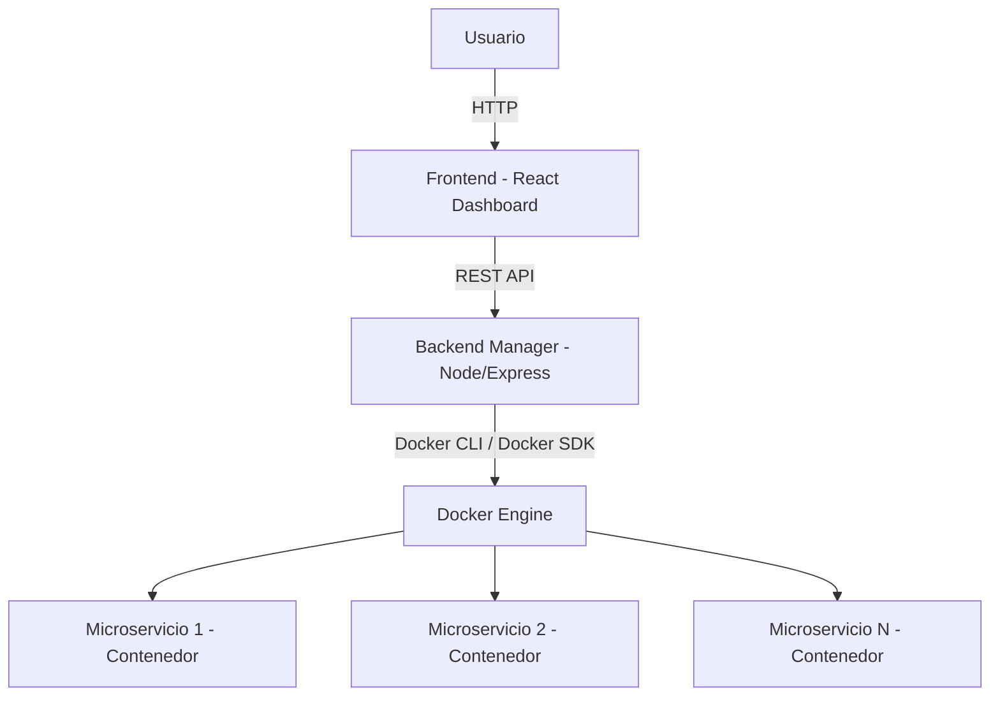
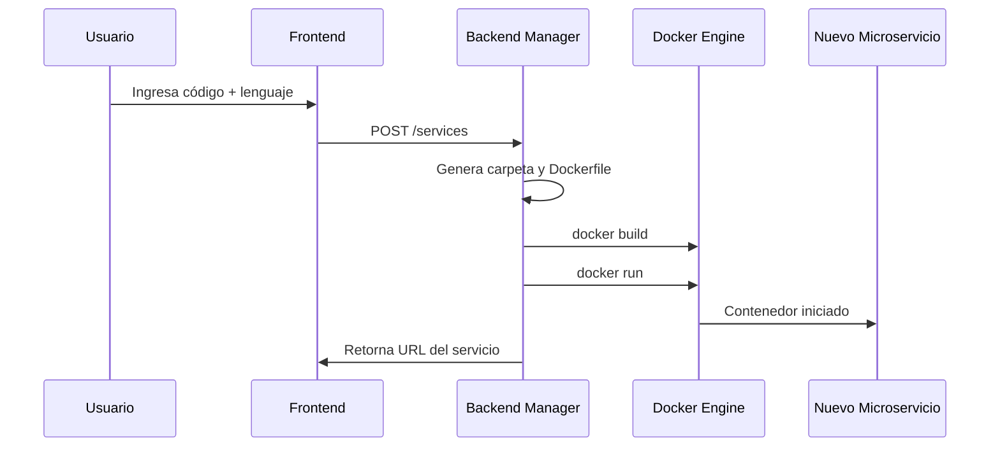
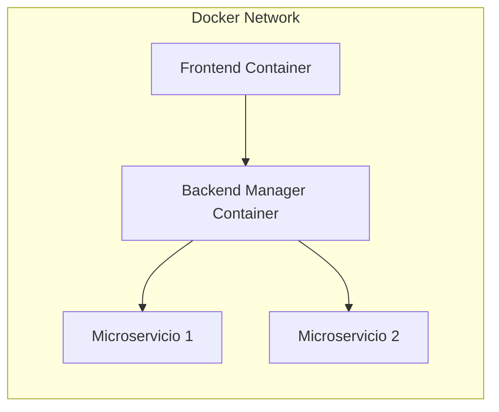

## Arquitectura del Sistema

La plataforma está diseñada bajo un enfoque de **arquitectura basada en microservicios con orquestación centralizada**, donde un componente gestor administra dinámicamente la creación y el ciclo de vida de los servicios.

### Diagrama General de Arquitectura

#### Descripción

La arquitectura se compone de tres capas principales:

* **Capa de presentación**: Interfaz web desarrollada en React.
* **Capa de Gestión**: Backend encargado de la orquestación de microservicios.
* **Capa de Ejecucición**: Conjunto de contenedores Docker que ejecutan microservicios independientes.

Cada microservicio se ejecuta en un contenedor aislado, garantizando desacoplamiento y escalabilidad.

### Diagrama de Secuencia - Creación Dinámica de Microservicio

#### Descripción

El proceso de creación es completamente automatizado:

1. El usuario envía el código fuente.
2. El backend genera la estructura del servicio.
3. Se construye la imagen Docker.
4. Se despliega el contenedor.
5. El sistema retorna el endpoint expuesto.

### Diagrama de Red y Aislamiento

#### Descripción

Todos los contenedores se encuentran dentro de una red virtual Docker que permite:

* Comunicación interna segura
* Aislamiento entre servicios
* Escalabilidad dinámica
* Independencia de despliegue