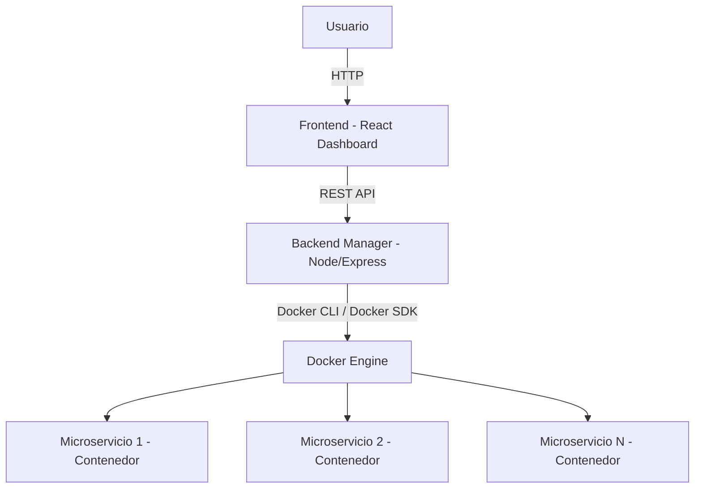
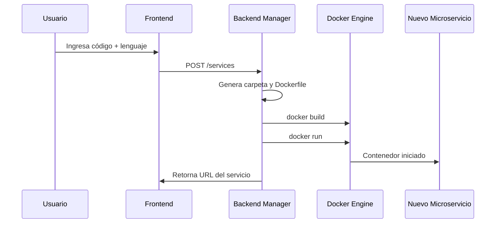
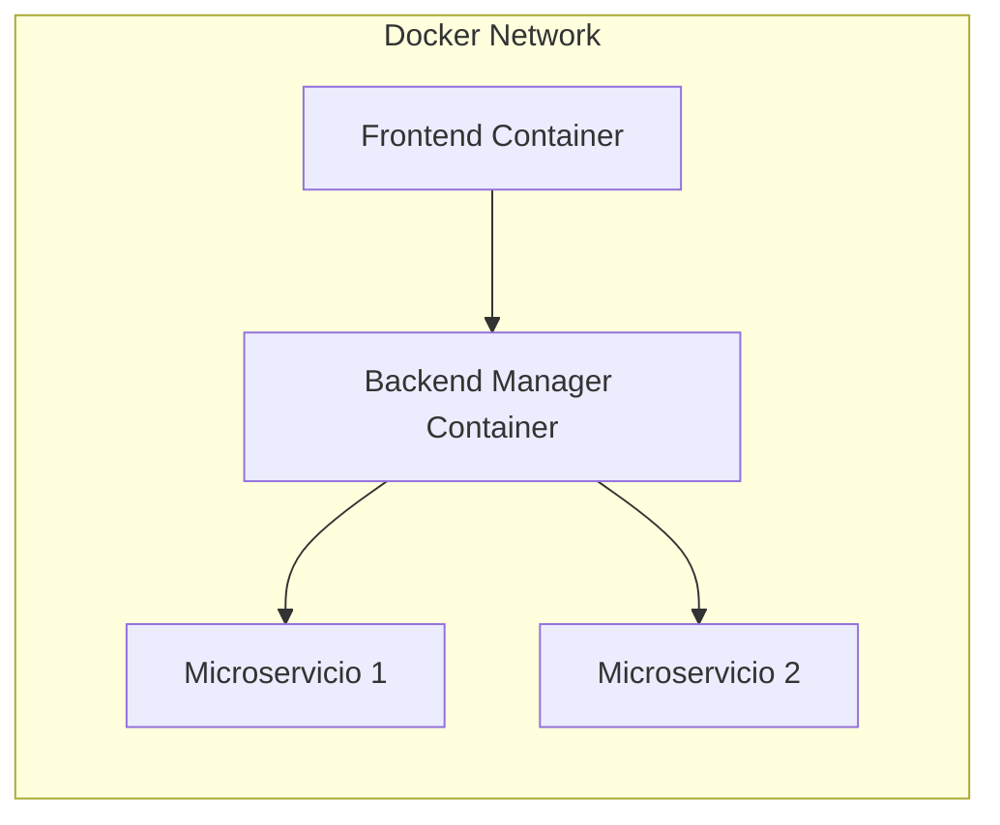
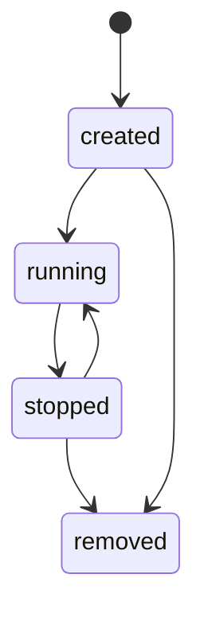

## Descripción del Proyecto

La Plataforma de Microservicios es una aplicación web que permite la creación, gestión y eliminación dinámica de microservicios ejecutados en contenedores Docker. Cada microservicio es generado a partir de código fuente ingresado por el usuario y desplegado automáticamente como un servicio HTTP independiente.

## Tecnologías Utilizadas

* **Backend Manager**
  * **Node.js** — Entorno de ejecución del servidor
  * **Express.js** — Framework para API REST
  * **JavaScript (CommonJS)** — Lenguaje principal del backend
  * **Docker Socket (/var/run/docker.sock)** — Comunicación directa con el Docker Engine para la creación y gestión dinámica de contenedores.

* **Frontend (Dashboard)**
  * **React** — Biblioteca para interfaz de usuario
  * **TypeScript** — Tipado estático para mayor seguridad
  * **Vite** — Bundler y servidor de desarrollo
  * **ESLint** — Control de calidad y reglas de estilo

* **Contenerización**
  * **Docker** — Contenedores para aislamiento
  * **Docker Compose** — Orquestación de servicios base
  * **Docker BuildKit** — Construcción eficiente de imágenes

* **Microservicios Dinámicos**
  * **Python** + Flask (Soporte dinámico)
  * **Node.js** + Express (Soporte dinámico)
  * Generación automática de Dockerfile
  * Asignación dinámica de puertos

## Arquitectura del Sistema

La plataforma está diseñada bajo un enfoque de **arquitectura basada en microservicios con orquestación centralizada**, donde un componente gestor administra dinámicamente la creación y el ciclo de vida de los servicios.

### Diagrama General de Arquitectura



#### Descripción

La arquitectura se compone de tres capas principales:

* **Capa de Presentación**: Interfaz web desarrollada en React.
* **Capa de Gestión**: Backend encargado de la orquestación de microservicios.
* **Capa de Ejecución**: Conjunto de contenedores Docker que ejecutan microservicios independientes.

Cada microservicio se ejecuta en un contenedor aislado, garantizando desacoplamiento y escalabilidad.

### Diagrama de Secuencia - Creación Dinámica de Microservicio



#### Descripción

El proceso de creación es completamente automatizado:

1. El usuario envía el código fuente.
2. El backend genera la estructura del servicio.
3. Se construye la imagen Docker.
4. Se despliega el contenedor.
5. El sistema retorna el endpoint expuesto.

### Diagrama de Red y Aislamiento



#### Descripción

Todos los contenedores se encuentran dentro de una red virtual Docker que permite:

* Comunicación interna segura
* Aislamiento entre servicios
* Escalabilidad dinámica
* Independencia de despliegue

## Modelo de Microservicio

Cada microservicio es representado internamente mediante la siguiente estructura:

```typescript
type Microservice = {
  id: string
  name: string
  description: string
  language: "python" | "node"
  port: number
  status: "created" | "running" | "stopped"
  containerId?: string
  createdAt: Date
}
```

### Ciclo de Vida del Microservicio



## Cómo Ejecutar el proyecto

Para levantar la plataforma: 

```
docker compose up --build
```

Servicios disponibles:

* Frontend: `http://localhost:3000`
* Backend: `http://localhost:5000`
  
La plataforma no incluye microservicios por defecto.

Estos deben ser creados dinámicamente desde el dashboard.

## Especificación del Código del Usuario

El usuario debe escribir únicamente la lógica del servicio, respetando las siguientes reglas:

* **Python**
  * Debe asignar el resultado final a una variable llamada result.
  * Puede acceder a parámetros mediante request.args.
  * No debe declarar Flask ni iniciar el servidor.

* **Node.js**
  * Debe asignar el resultado final a una variable llamada result.
  * Puede acceder a parámetros mediante req.query.
  * No debe declarar Express ni iniciar el servidor.

El sistema se encarga automáticamente de generar la estructura HTTP necesaria.

## Principios Arquitectónicos Aplicados

* Aislamiento mediante contenedores independientes.
* Desacoplamiento entre frontend, backend y microservicios.
* Orquestación centralizada del ciclo de vida.
* Escalabilidad dinámica sin límite predefinido de servicios.

La plataforma no define un número máximo de microservicios, permitiendo la creación dinámica de instancias según demanda.

## Checklist antes de presentar

- [ ] Quitar volúmenes en docker-compose
- [ ] Reconstruir imágenes limpias
- [ ] Probar desde cero con docker compose up --build
- [ ] Verificar que no haya microservicios por defecto
- [ ] Confirmar que README esté actualizado